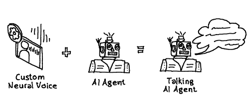
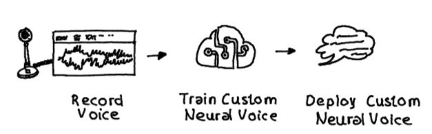

# Azure AI | Custom Neural Voice

## Introduction

With the availability of [Custom Neural Voice](https://learn.microsoft.com/en-us/azure/ai-services/speech-service/custom-neural-voice),  users can easily create and deploy unique voice models tailored to their needs. This functionality is particularly useful for giving AI agents, or other applications a distinctive and personalized voice.

Azure [AI Text to Speech](https://learn.microsoft.com/en-us/azure/ai-services/speech-service/index-text-to-speech) enables the conversion of text into natural-sounding speech, making it ideal for creating engaging and accessible user experiences.

Beside Custom Neural Voice, it offers a wide range of [stock voices in multiple languages and styles](https://techcommunity.microsoft.com/blog/azure-ai-services-blog/azure-ai-speech-text-to-speech-feb-2025-updates-new-hd-voices-and-more/4387263), allowing to choose the most suitable voice for agentic applications.

## Custom Neural Voice Lite

The Custom Neural Voice ***Lite*** option empowers users to create an impressive custom voice model with as little as 20 recorded sentences while Custom Neural Voice needs more training data to introduces a highly natural-sounding voice.

Leveraging [Azure AI Speech Studio](https://speech.microsoft.com/), the process of recording and providing audio is made simple and intuitive, ensuring a seamless experience.

This simplicity extends to creating and deploying the custom neural voice model, making it ready for immediate integration into applications with minimal effort.

Just follow [this step-by-step tutorial](https://learn.microsoft.com/en-us/azure/ai-services/speech-service/custom-neural-voice-lite) to create a custom neural voice lite model to enrich your applications. There are 3 major steps needed:

- Record voice
- Train custom neural voice model
- Deploy synthetic voice

After the custom neural voice model is deployed it can be used by applications using default Speech-To-Text SDKs.

## Repo Content

| Item | Description | Details |
|------| ----------- | ------- |
| [setup.azcli](./setup/setup.azcli) | Azure CLI Script to deploy the necessary Azure AI Speech Service instance | Use [MS PowerShell](https://learn.microsoft.com/de-de/powershell/scripting/install/installing-powershell) to execute the script |
| [config folder](./config/) | Folder containing an [env file](./config/config.env.template) | Rename the file to `config.env.template' to `config.env` and provide the necessary parameter if you already have an instance of Azure AI Speech. Execute [setup.azcli](./setup/setup.azcli) to create an instance of Azure AI Speech if not yet available. Pls take care to record and deploy the custom neural voice model using the [Azure AI Speech portal](https://speech.microsoft.com/portal/) |
| [synthesize_custom_voice.ipynb](./src/synthesize_custom_voice.ipynb) | C# sample code highlighting how to synthesize text.  | Polyglot notebook highlighting a ***custom neural voice model*** (stream / batch) to synthesize text |
| [synthesize_stock_voice.ipynb](./src/synthesize_custom_voice.ipynb) | C# sample code highlighting | Polyglot notebook highlighting a ***stock voice model*** (stream / batch) to synthesize text |
